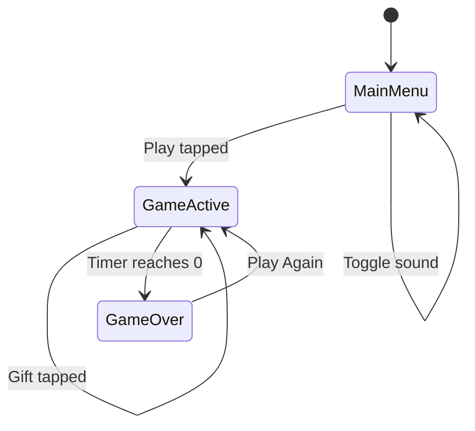
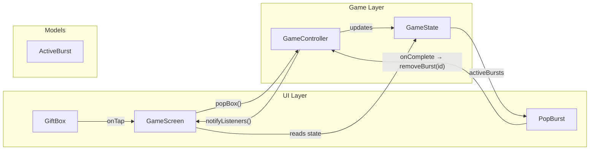
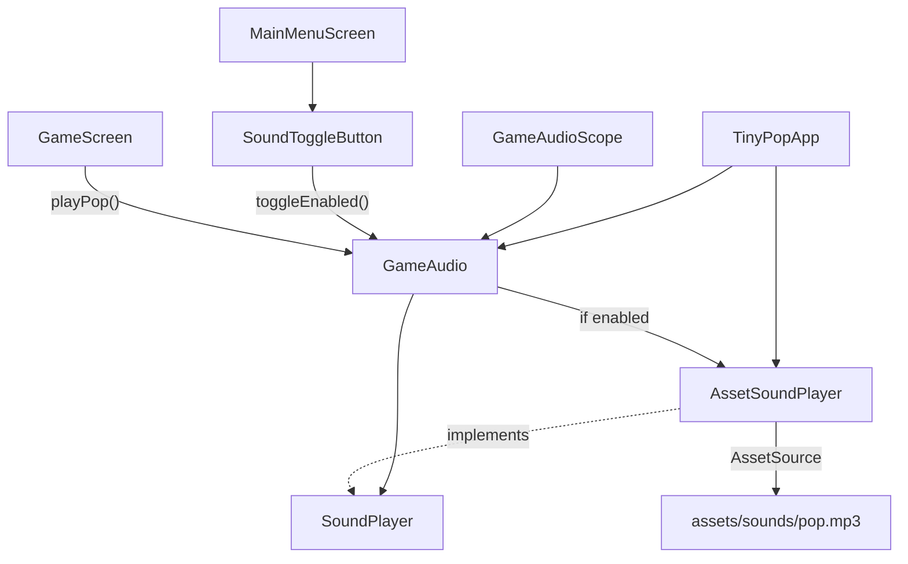

# Tiny Pop — Architecture

Technical reference for the Tiny Pop Flutter prototype. This document describes the current project structure, runtime flows, and recommended extension patterns. It reflects the codebase as of the production-ready refactor (Blocks A–C + game-feel pass).

---

## Overview

Tiny Pop is a timed casual tap game: the player taps a gift box as many times as possible within 60 seconds. The project uses **Flutter built-in state management only** (`ChangeNotifier`, `InheritedNotifier`, local `AnimationController`s). There is no external state-management package.

Design goals embodied in the architecture:

- Separate **rules** (controller + models) from **presentation** (UI + widgets)
- Keep **services** (audio) injectable and swappable
- Centralize tunable values in **core** constants
- Support **game feel** in widgets and screens without polluting game logic

---

## Folder Structure

```
tiny_pop/
├── lib/
│   ├── main.dart                 # App entry point (bootstrap only)
│   ├── core/                     # App shell, shared constants, theme tokens
│   ├── models/                   # Immutable data objects
│   ├── game/                     # Game rules and state machine
│   ├── services/                 # Cross-cutting platform services
│   ├── ui/                       # Full-screen routes / orchestration
│   └── widgets/                  # Reusable presentational components
├── assets/
│   └── sounds/
│       └── pop.mp3               # Tap sound effect
├── test/                         # Unit and widget tests
├── pubspec.yaml
└── ARCHITECTURE.md
```

### File inventory

| Path | Role |
|------|------|
| `lib/main.dart` | Calls `runApp`; re-exports `TinyPopApp` for tests |
| `lib/core/tiny_pop_app.dart` | Root widget, audio lifecycle, `MaterialApp` |
| `lib/core/game_constants.dart` | Durations, spawn bounds, palette list, layout numbers |
| `lib/core/app_colors.dart` | Shared color tokens (menu + game) |
| `lib/models/game_state.dart` | Snapshot of all mutable game fields |
| `lib/models/active_burst.dart` | Confetti burst instance (id + center) |
| `lib/game/game_controller.dart` | Timer, scoring, spawn logic, game over |
| `lib/services/sound_player.dart` | Abstract sound backend |
| `lib/services/asset_sound_player.dart` | `audioplayers` + asset-backed pop sound |
| `lib/services/placeholder_sound_player.dart` | No-op fallback implementation |
| `lib/services/game_audio.dart` | Sound toggle + `GameAudioScope` |
| `lib/ui/main_menu_screen.dart` | Title screen, Play navigation |
| `lib/ui/game_screen.dart` | Game orchestration, shake/tilt, burst layering |
| `lib/widgets/gift_box.dart` | Tappable target with idle/tap animations |
| `lib/widgets/pop_burst.dart` | Confetti particle effect (`CustomPaint`) |
| `lib/widgets/game_hud.dart` | Score and timer labels |
| `lib/widgets/game_over_panel.dart` | Final score + Play Again |
| `lib/widgets/menu_bubble.dart` | Decorative menu circles |
| `lib/widgets/sound_toggle_button.dart` | Volume on/off control |

---

## Folder Responsibilities

### `lib/` (root)

- **`main.dart`** — Single responsibility: bootstrap. No business logic. Exports `TinyPopApp` so tests can import one entry file.

### `lib/core/`

Application-wide building blocks that are not game-specific rules and not UI screens.

- **`tiny_pop_app.dart`** — Creates long-lived service instances (`AssetSoundPlayer`, `GameAudio`), wraps the tree in `GameAudioScope`, hosts `MaterialApp`.
- **`game_constants.dart`** — Magic numbers for timer length, box spawn region, animation durations/curves, burst overlay size.
- **`app_colors.dart`** — Visual design tokens reused across menu and game.

### `lib/models/`

Pure data types. No `BuildContext`, no timers, no side effects.

- **`GameState`** — Immutable snapshot with `copyWith` and `initial()` factory.
- **`ActiveBurst`** — Lightweight effect record tracked by the controller until animation completes.

### `lib/game/`

Game rules and simulation. Flutter UI imports this layer; this layer never imports UI.

- **`GameController`** — Owns `GameState`, countdown `Timer`, random spawn logic. Exposes `popBox()`, `playAgain()`, `removeBurst()`, `start()`, `dispose()`.

### `lib/services/`

External capabilities and app-level settings accessed from multiple screens.

- **`SoundPlayer`** — Interface for effect playback (enables testing and backend swaps).
- **`AssetSoundPlayer`** — Production implementation using `audioplayers` + bundled MP3; fails safe if asset is missing or corrupt.
- **`PlaceholderSoundPlayer`** — Debug/no-op fallback.
- **`GameAudio` / `GameAudioScope`** — User-facing sound on/off; inherited widget for dependency lookup.

### `lib/ui/`

Route-level widgets that compose smaller pieces and wire user input to controllers/services.

- **`MainMenuScreen`** — Static layout; navigates to game via `pushReplacement`.
- **`GameScreen`** — Owns `GameController` and feel controllers (shake, move tilt). Delegates rendering to widgets; triggers audio on tap.

### `lib/widgets/`

Stateless or self-contained animated components with minimal knowledge of game rules.

- Presentation only: they receive props and callbacks.
- **`GiftBox`** and **`PopBurst`** own local `AnimationController`s for feel (idle float, squash/stretch, particles).

### `assets/`

Binary resources referenced from `pubspec.yaml`. Sound path must stay in sync with `AssetSoundPlayer.popAssetPath`.

### `test/`

- **`game_audio_test.dart`** — Unit tests for `GameAudio` toggle and delegation.
- **`widget_test.dart`** — End-to-end smoke tests (menu → game → score → game over → play again).

---

## Widget Tree

### Application root

```
runApp
└── TinyPopApp (StatefulWidget)
    └── GameAudioScope (InheritedNotifier<GameAudio>)
        └── MaterialApp
            └── MainMenuScreen
```

### Main menu

```
MainMenuScreen
└── Scaffold
    └── Container (gradient background)
        └── SafeArea
            └── Stack
                ├── MenuBubble × N (decorative)
                ├── SoundToggleButton
                └── Column (title, subtitle, Play button)
```

### Game screen

```
GameScreen
└── ListenableBuilder ← GameController
    └── Scaffold
        └── SafeArea
            └── AnimatedBuilder ← shake + move tilt
                └── Transform.translate (screen shake)
                    └── Stack
                        ├── GameHud
                        │   └── Stack
                        │       ├── Positioned "Score: N"
                        │       └── Positioned "Time: N"
                        ├── Positioned × bursts
                        │   └── PopBurst (CustomPaint)
                        ├── AnimatedPositioned
                        │   └── Transform.rotate (travel tilt)
                        │       └── GiftBox
                        │           └── (float, squash, shadow animations)
                        └── [if game over] Positioned.fill
                            └── ColoredBox (dim)
                                └── GameOverPanel
```

---

## Game Flow



| Phase | What happens |
|-------|----------------|
| **Launch** | `TinyPopApp` mounts; sound ON by default; menu shown |
| **Play** | `MainMenuScreen` replaces route with `GameScreen` |
| **Start** | `GameController.start()` begins 60s countdown |
| **Active play** | User taps gift → score++, box respawns, burst spawns |
| **Game over** | Timer hits 0 → `isActive = false`; input disabled; overlay shown |
| **Play again** | State reset to `GameState.initial()`; timer restarted |
| **Sound toggle** | Available on menu; setting persists for the session via `GameAudio` |

Game rules (unchanged by architecture):

- 60-second round
- +1 score per successful tap while active
- Box moves to random position/size/color after each tap
- No scoring or tapping after time expires

---

## Data Flow



**Direction of data:**

1. **User tap** → `GameScreen._handlePopBox()` (audio + controller + feel animations)
2. **Controller** computes new `GameState` immutably via `copyWith`
3. **`ListenableBuilder`** rebuilds `GameScreen` from `controller.state`
4. **Widgets** receive primitive props (`score`, `boxX`, `color`, etc.)
5. **Burst cleanup** — `PopBurst` calls back when animation ends; controller removes burst from list

The controller never references widgets. Widgets never mutate state directly.

---

## Audio Flow



| Step | Component | Behavior |
|------|-----------|----------|
| 1 | `TinyPopApp` | Creates `AssetSoundPlayer` + `GameAudio(player: …)` |
| 2 | `GameAudioScope` | Makes `GameAudio` available to all routes |
| 3 | Menu toggle | `SoundToggleButton` flips `GameAudio.isEnabled` |
| 4 | Tap | `GameScreen` calls `GameAudioScope.of(context).playPop()` **before** `popBox()` |
| 5 | Gate | `GameAudio` skips playback when disabled |
| 6 | Playback | `AssetSoundPlayer` loads asset once; plays via `audioplayers` |
| 7 | Failure | Missing/corrupt/unsupported audio disables pop for session; no crash; one debug log |

Audio is intentionally triggered from the **screen layer**, not `GameController`, keeping rules free of `BuildContext` and platform APIs.

---

## Controller Flow

### `GameController` lifecycle

```
constructor → state = GameState.initial()
start()     → Timer.periodic(every 1s)
popBox()    → validate isActive → compute burst center → copyWith(new state)
playAgain() → GameState.initial() → start()
dispose()   → cancel timer
```

### Timer tick (every second while active)

```
remainingSeconds--
if remainingSeconds <= 0:
    remainingSeconds = 0
    isActive = false
    cancel timer
notifyListeners()
```

### `popBox()` state transitions

| Field | Change |
|-------|--------|
| `score` | +1 |
| `boxSize` | random in `[80, 149]` |
| `boxColor` | random from `GameConstants.boxColors` |
| `boxX` | random in `[0, 250)` |
| `boxY` | random in `[150, 550)` |
| `activeBursts` | append `ActiveBurst(id, center)` |

### Screen-owned feel (not in controller)

`GameScreen` runs parallel animation controllers on tap:

- **Screen shake** — short `Transform.translate` on the playfield stack
- **Move tilt** — `Transform.rotate` derived from movement delta, elastic settle
- **`GiftBox`** — idle float, squash/stretch, shadow pulse (local controllers)

This split keeps `GameController` deterministic and easy to unit test while allowing rich presentation.

---

## Dependencies

| Package | Purpose |
|---------|---------|
| `flutter` | UI framework |
| `cupertino_icons` | Icon font (volume icons on menu) |
| `audioplayers` | MP3 playback for pop sound |
| `flutter_test` / `flutter_lints` | Dev tooling |

No Provider, Riverpod, Bloc, or Flame. State is local + inherited.

---

## Testing Strategy

| Test file | Scope |
|-----------|-------|
| `game_audio_test.dart` | `GameAudio` enabled default, toggle, delegation to fake `SoundPlayer` |
| `widget_test.dart` | Menu → game navigation, score increment, timer tick, game over, play again |

Widget tests use fixed `pump` durations instead of `pumpAndSettle` because `GiftBox` runs a continuous idle animation.

---

## Future Extension Points

### Game rules

- **`GameController`** — Add combos, power-ups, difficulty curves, or multiple target types by extending `GameState` and controller methods.
- **`GameConstants`** — Parameterize per game mode or read from remote config.
- **Inject `Random`** — Already supported via constructor for deterministic tests.

### New screens / modes

- Add routes under `lib/ui/` (e.g. `SettingsScreen`, `TutorialScreen`).
- Replace `MaterialApp(home: …)` with named routes or a small app router in `core/`.

### Audio

- Extend **`SoundPlayer`** with `playGameOver()`, `playTick()`, etc.
- Swap **`AssetSoundPlayer`** for a pooled/multi-channel implementation if SFX overlap grows.
- Persist mute preference via `shared_preferences` in a new `services/settings_service.dart`.

### Visual effects

- Add new widgets under `lib/widgets/` (e.g. `ScorePopup`, `StreakBanner`).
- Keep effect lifecycle callbacks (`onComplete`) parallel to `PopBurst` → `removeBurst`.

### Models

- Split **`GameState`** into smaller records if fields grow (`PlayerState`, `TargetState`, `SessionState`).

### Platform / backend

- **`services/`** folder is the intended home for analytics, ads, save data, leaderboards.

### Empty / reserved folders

The original refactor plan included `lib/utils/` for shared helpers. It is not present yet—add when cross-cutting pure functions emerge (geometry, formatting, seeded random helpers).

---

## Reusing This Project as a Multi-Game Foundation

Tiny Pop is structured as a **single-game shell** that can evolve into a **casual game studio template**. Below are concrete patterns for cloning and scaling.

### 1. Extract a shared “engine” package

Create a monorepo or private package (e.g. `pop_games_core`) containing:

| From Tiny Pop | Becomes |
|---------------|---------|
| `core/tiny_pop_app.dart` pattern | `CasualApp` with pluggable home + services |
| `services/game_audio.dart` + `SoundPlayer` | Generic `AudioService` |
| `widgets/game_hud.dart`, `game_over_panel.dart` | Shared HUD / results modules |
| `ui/main_menu_screen.dart` layout | `MenuTemplate` with injected title, colors, CTA |

Each game repo keeps only:

- `game/<name>_controller.dart`
- `models/<name>_state.dart`
- `ui/<name>_screen.dart`
- Game-specific widgets
- `assets/` for that title

### 2. Standardize the controller contract

Define a minimal interface all casual games implement:

```dart
abstract class CasualGameController extends ChangeNotifier {
  bool get isActive;
  int get score;
  void start();
  void reset();
}
```

Tiny Pop’s `GameController` already matches this shape. New games swap implementation while reusing `GameScreen` scaffolding patterns (HUD, game over, shake, audio hook).

### 3. Configuration-driven constants

Move per-game tuning out of code:

```yaml
# games/tiny_pop/config.yaml
duration_seconds: 60
target: gift
spawn_region: { ... }
```

Load into `GameConstants` at startup so designers can fork games without Dart changes.

### 4. Theme / branding layer

- **`AppColors`** → per-game JSON or `ThemeExtension`
- **`MainMenuScreen`** → accept `MenuConfig(title, gradient, heroEmoji, tagline)`
- Keep **`core/`** free of game-specific strings

### 5. Effect library

`PopBurst`, shake, elastic move, and `GiftBox` animation patterns form a **feel toolkit**. For a new game:

- Rename `GiftBox` → `TapTarget` with configurable child/icon
- Reuse `PopBurst` colors from target palette
- Keep screen-level shake/tilt as optional mixins or a `GameFeelMixin` on `State`

### 6. Navigation and session model

For a multi-game hub:

```
HubScreen → selects game
    ├── TinyPopGameScreen
    ├── BubblePopGameScreen
    └── ...
```

Shared `GameAudioScope` stays at app root (current pattern). Each game screen owns its controller lifecycle (`initState` start, `dispose` cancel).

### 7. CI and quality gates

The existing test split is a good template per game:

- **Unit** — controller + services
- **Widget** — one happy-path session per game

Run `flutter analyze` + tests in CI for every game package in the monorepo.

### 8. Suggested repo layouts

**Option A — Monorepo**

```
studio/
├── packages/
│   ├── casual_core/
│   ├── casual_audio/
│   └── casual_widgets/
└── games/
    ├── tiny_pop/
    ├── bubble_pop/
    └── slice_pop/
```

**Option B — Template clone**

Use Tiny Pop as `game-template`; script replaces package name, assets, and `GameController` rules; keep folder layout identical for familiarity.

### 9. What to keep stable vs. fork

| Keep stable across games | Fork per game |
|--------------------------|---------------|
| Folder layout (`core`, `game`, `ui`, `widgets`, `services`, `models`) | `GameController` rules |
| `SoundPlayer` abstraction | Assets and colors |
| `GameAudioScope` pattern | Target widget and effects |
| HUD / game over patterns | Menu copy and branding |
| Test structure | Spawn logic and win/lose conditions |

---

## Summary

Tiny Pop separates **bootstrap** (`main.dart`), **app services** (`core/`, `services/`), **rules** (`game/`, `models/`), and **presentation** (`ui/`, `widgets/`). User input flows screen → controller → immutable state → widgets. Audio flows screen → `GameAudio` → `SoundPlayer`. Game feel lives in widgets and screen animation controllers, keeping rules testable and portable.

This layout is intentionally small but scales horizontally: new casual titles reuse the shell, swap the controller/models, and plug into the same audio, menu, HUD, and game-over patterns.
